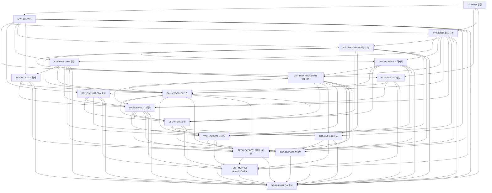

# 던전 오피스 MVP 문서 인덱스

이 `docs/`는 **Android·Google Play 무료 앱으로 출시할 거래처 1곳·5라운드 MVP**에 필요한 결정만 보관한다. 풀게임 확장안, 미래 기능 예약석과 이전 문서의 호환 스텁은 두지 않으며 Git 이력만 복구 수단으로 사용한다.

이 문서들은 완성된 기능 목록이 아니라 구현해야 할 규범 계약이다. 저장소의 현재 구현 범위와 실행 방법은 루트 [`README.md`](../README.md)가 소유한다.

## 문서 규칙

- 각 결정은 하나의 Source of Truth만 가진다.
- `depends_on`은 해당 문서를 작성하기 전에 확정되어야 하는 직접 입력만 적는다.
- 다른 문서의 규칙·목록·수치를 복제하지 않고 문서 ID와 절을 참조한다.
- 작업 시간·점수·골드·용량·커트라인 등 게임플레이 밸런스 값은 `BAL-MVP-001`만 소유한다. `res://data/*.json`은 규범 문서의 버전이 표시된 실행용 투영이며, 문서→JSON→fixture를 같은 변경에서 갱신한다.
- 상태는 `Draft → Review → Approved → Deprecated` 순서로 관리한다. Approved 문서는 Draft 선행 문서에 의존할 수 없다.
- 동일 Wave 문서끼리 직접 의존하지 않으면 병렬 작성할 수 있다.
- 이 표에 없는 Markdown은 현재 MVP 규범 문서가 아니다.

`GDD-001`, `MVP-001`, `BUS-MVP-001`은 사용자가 확정한 비전·5라운드 Android 범위·무료 정책의 승인 기준선이다. 나머지 문서는 구현과 검증 중인 Draft이며, 코드가 일부 존재한다는 이유만으로 승인된 것으로 보지 않는다.

## 현재 문서 카탈로그와 작성 Wave

| Wave | 문서 ID | 파일 | 유일 책임 | 직접 `depends_on` |
|---:|---|---|---|---|
| 0 | `GDD-001` | [GDD.md](GDD.md) | 게임 비전과 헌법 | 없음 |
| 1 | `MVP-001` | [mvp-scope.md](mvp-scope.md) | 5라운드 MVP 포함·제외 범위와 검증 가설 | `GDD-001` |
| 2 | `BUS-MVP-001` | [commercial.md](commercial.md) | 무료 MVP와 미래 유료 스테이지의 허용 경계 | `GDD-001`, `MVP-001` |
| 2 | `SYS-CORE-001` | [core-gameplay.md](core-gameplay.md) | 라운드 안의 게임 규칙 | `GDD-001`, `MVP-001` |
| 3 | `REL-PLAY-001` | [play-release.md](play-release.md) | Play 등록·개인정보·지원·Data safety 계약 | `MVP-001`, `BUS-MVP-001` |
| 3 | `SYS-PROG-001` | [progression.md](progression.md) | 5라운드 진행과 영속 성장 | `MVP-001`, `SYS-CORE-001` |
| 3 | `CNT-ITEM-001` | [items.md](items.md) | MVP 아이템·시설·일꾼 카탈로그 | `MVP-001`, `SYS-CORE-001` |
| 4 | `SYS-ECON-001` | [economy-rewards.md](economy-rewards.md) | 골드의 획득·소비·보상 구조 | `MVP-001`, `SYS-PROG-001` |
| 4 | `CNT-RECIPE-001` | [recipes.md](recipes.md) | 입력·출력·공정 관계 | `SYS-CORE-001`, `CNT-ITEM-001` |
| 5 | `CNT-MVP-ROUND-001` | [mvp-rounds.md](mvp-rounds.md) | R1~R5와 의뢰 구성 | `SYS-CORE-001`, `SYS-PROG-001`, `CNT-ITEM-001`, `CNT-RECIPE-001` |
| 6 | `BAL-MVP-001` | [balance.md](balance.md) | 모든 공식·시간·가격·커트라인 | 규칙·진행·경제·아이템·레시피·라운드 |
| 7 | `UX-MVP-001` | [ux-scenarios.md](ux-scenarios.md) | 전체 사용자 여정과 정상·실패·중단·복구 시나리오 | 규칙·진행·경제·라운드·밸런스·상업·Play 출시 |
| 8 | `UI-MVP-001` | [ui-screens.md](ui-screens.md) | 화면·상태·전이·입력 명세 | UX·Play 출시·아이템·레시피·라운드·밸런스 |
| 9 | `ART-MVP-001` | [art-spec.md](art-spec.md) | MVP 시각 방향·런타임 및 스토어 에셋 명세 | MVP·Play 출시·UI·아이템·라운드 |
| 9 | `TECH-SIM-001` | [runtime-contract.md](runtime-contract.md) | 결정론적 상태·명령·이벤트·틱·읽기 모델 | 규칙·진행·아이템·레시피·라운드·밸런스·UX·UI |
| 10 | `AUD-MVP-001` | [audio-spec.md](audio-spec.md) | 음악·효과음·햅틱 명세 | MVP·UX·UI·아트·라운드·밸런스 |
| 10 | `TECH-DATA-001` | [data-save-contract.md](data-save-contract.md) | 콘텐츠 스키마·저장·복구·마이그레이션·정산 원자성 | 도메인·콘텐츠·밸런스·UX·런타임 계약 |
| 11 | `TECH-MVP-001` | [technical-spec.md](technical-spec.md) | Godot 프로젝트·Android·오프라인·빌드·서명·CI | MVP·상업·Play 출시·UX·UI·아트·런타임·데이터 |
| 12 | `QA-MVP-001` | [qa-release.md](qa-release.md) | 기능·결정론·실기·재미·Play 출시 게이트 | 모든 산출 문서 |

표에서 긴 dependency 집합을 의미 단위로 줄여 쓴 행의 정확한 직접 목록은 해당 문서 메타데이터가 Source of Truth다.

## 의존성 DAG

## 추적성 최소 계약

| 원천 결정 | 필수 소비 문서·산출물 |
|---|---|
| GDD 원칙 | MVP 범위, 규칙, QA |
| 상업 정책 | Play 출시, UX, Android 기술, QA·Play 제출 |
| 게임 규칙 | 진행, 콘텐츠, 밸런스, UX, 런타임, 저장 |
| 사용자 시나리오 | UI 화면·상태, 오디오, 런타임 읽기 모델, 저장 복구, QA |
| 화면 상태 | 런타임 명령·읽기 모델, 에셋, Android 조립 |
| 아이템·시설·레시피·라운드 | 밸런스 파라미터, versioned JSON projection, fixture |
| 런타임 상태·이벤트 | 저장 snapshot, Android 앱 계층, 결정론 테스트 |
| Play 정책·개인정보 | 로컬 법적 고지, Pages 원문, manifest, Data safety, 스토어 에셋 |

## 확정된 출시 경계

- 플랫폼·스토어: Android 단독, Google Play.
- 현재 가격·콘텐츠: 무료, 거래처 1곳의 R1~R5 전체 개방.
- 현재 상업 구현: Billing SDK·상품·페이월·구매 복원·상업 entitlement 없음.
- 런타임: 인터넷 권한·원격 SDK·계정·광고·분석이 없는 오프라인 앱.
- 공개 지원·개인정보 URL: `https://mrkimkim.github.io/dungeon-office/`와 `/privacy/`.
- 미래 선택지: 같은 application ID와 서명 계보를 유지한 채 후속 스테이지 팩 1회 구매를 별도 승인할 수 있으나, 승인 전에는 코드·데이터·화면에 예약석을 만들지 않는다.

Google Play에서 무료로 공개한 같은 앱은 나중에 유료 다운로드 앱으로 바꿀 수 없다. 유료화가 필요해지면 `BUS-MVP-001`의 후속 스테이지 방식부터 별도 검토한다.
